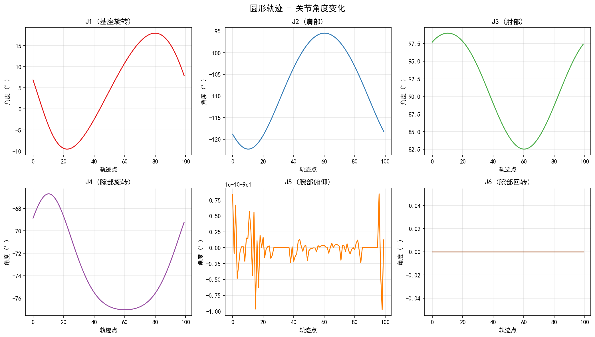
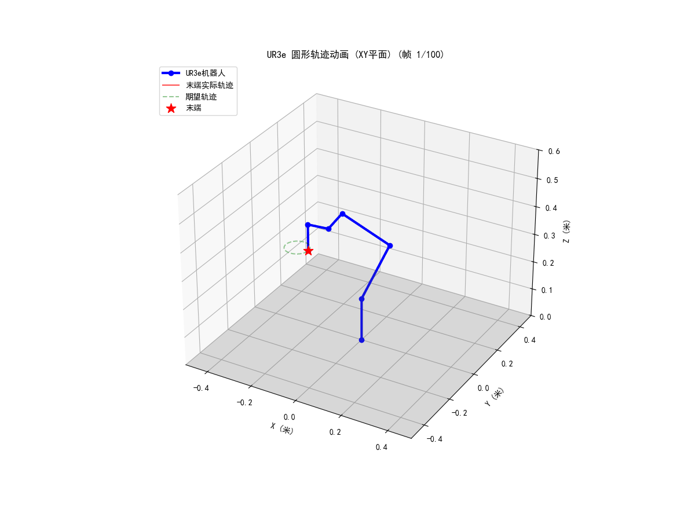
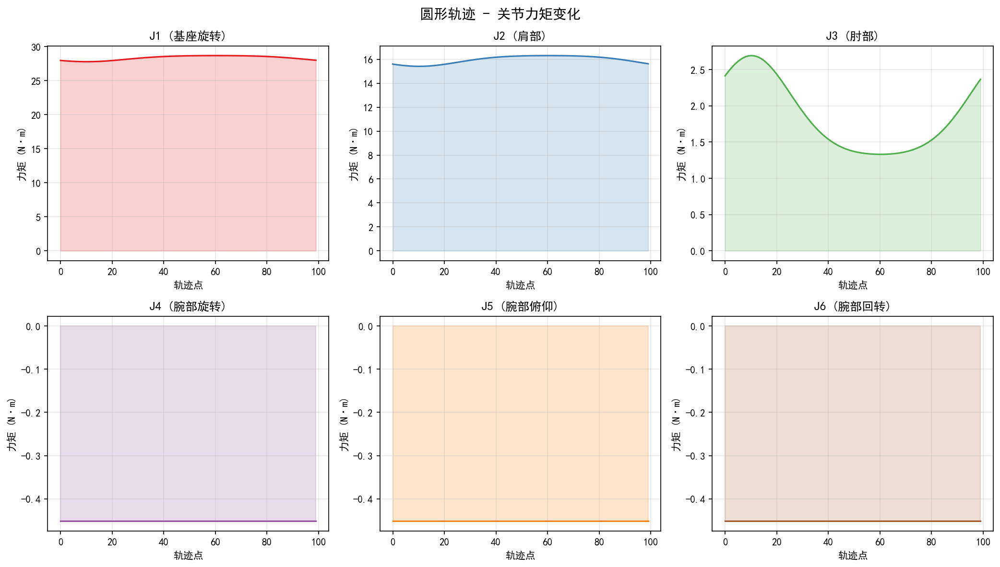
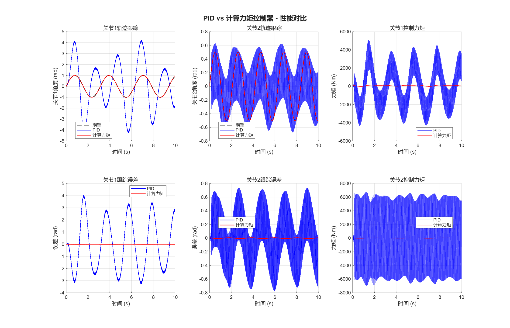

# 第4周-第1课 作业报告：UR3e简化模型的仿真

## 一、作业概述

本次作业完成了UR3e协作机器人的简化模型仿真，包括：

1. **Python部分**：UR3e正运动学建模、圆形轨迹规划、数值逆运动学求解、3D动画演示、简化动力学分析
2. **MATLAB部分**：二连杆机械臂的PID控制与计算力矩控制对比实验

## 二、UR3e机器人建模（Python）

### 2.1 DH参数表

UR3e是Universal Robots公司生产的6自由度协作机器人。根据官方技术文档，采用标准DH约定，其参数如下：

| 关节 | θ (关节角) | d (连杆偏置/m) | a (连杆长度/m) | α (连杆扭转/rad) |
|:----:|:----------:|:--------------:|:--------------:|:----------------:|
| J1   | q₁         | 0.15185        | 0              | π/2              |
| J2   | q₂         | 0              | -0.24355       | 0                |
| J3   | q₃         | 0              | -0.21320       | 0                |
| J4   | q₄         | 0.13105        | 0              | π/2              |
| J5   | q₅         | 0.08535        | 0              | -π/2             |
| J6   | q₆         | 0.09210        | 0              | 0                |

### 2.2 DH齐次变换矩阵

标准DH变换矩阵：

$$
^{i-1}T_i = \begin{bmatrix}
\cos\theta & -\sin\theta\cos\alpha & \sin\theta\sin\alpha & a\cos\theta \\
\sin\theta & \cos\theta\cos\alpha & -\cos\theta\sin\alpha & a\sin\theta \\
0 & \sin\alpha & \cos\alpha & d \\
0 & 0 & 0 & 1
\end{bmatrix}
$$

### 2.3 正运动学实现

```python
def forward_kinematics(self, joints_deg):
    theta = np.deg2rad(joints_deg)
    dh = self.get_dh_params(theta)

    positions = [np.array([0, 0, 0])]  # 基座位置
    T = np.eye(4)

    for params in dh:
        T = T @ self.dh_transform(*params)
        positions.append(T[:3, 3].copy())

    return np.array(positions), T
```

**测试结果**：在关节角 `[0, -90, 90, 0, 0, 0]` 度时，末端位置为：
- x = -0.2132 m
- y = -0.2231 m
- z = 0.3100 m

## 三、轨迹规划与逆运动学

### 3.1 圆形轨迹设计

在XY平面规划直径10cm的圆形轨迹：

- **圆心**：(-0.2, -0.15, 0.35) m
- **半径**：0.05 m (5cm)
- **采样点数**：100点

```python
def plan_circle(self, center, radius, n=100, plane='xy'):
    angles = np.linspace(0, 2*np.pi, n)
    path = np.zeros((n, 3))

    if plane == 'xy':
        path[:, 0] = center[0] + radius * np.cos(angles)
        path[:, 1] = center[1] + radius * np.sin(angles)
        path[:, 2] = center[2]
```

### 3.2 数值逆运动学

采用`scipy.optimize.least_squares`进行数值求解：

```python
def inverse_kinematics(self, x, y, z, q0=None):
    def error_func(q):
        _, T = self.forward_kinematics(q)
        pos = T[:3, 3]
        return pos - np.array([x, y, z])

    result = least_squares(error_func, q0, bounds=jbounds)
    return result.x
```

**关键策略**：使用上一时刻的解作为当前点的初值，保证解的连续性和收敛稳定性。

**求解结果**：100/100 个轨迹点成功求解逆运动学（100%成功率）。

### 3.3 关节角度变化曲线



从图中可以看出：
- 各关节角度变化平滑连续
- J2、J3关节承担主要运动（大臂和小臂）
- J1、J4、J5、J6关节变化较小，主要用于姿态调整

## 四、动画演示

### 4.1 动画内容

动画同时展示：
1. **机器人运动**：6自由度UR3e机械臂的连杆运动
2. **末端实际轨迹**：红色点云显示末端执行器的实际路径
3. **期望轨迹**：绿色虚线显示规划的圆形轨迹

### 4.2 动画效果



动画验证了：
- 正运动学计算正确
- 逆运动学求解准确
- 实际轨迹与期望轨迹高度重合

## 五、简化动力学分析（进阶）

### 5.1 力矩计算方法

采用雅可比转置法计算简化力矩：

$$
\tau = J^T \cdot F
$$

其中：
- $J$ 是几何雅可比矩阵
- $F$ 是末端力/力矩向量（包含重力补偿）

```python
def compute_torques_simple(self, joints_list, dt=0.05):
    for q in joints_list:
        J = self.compute_jacobian(q)
        # 重力补偿
        F_gravity = np.array([0, 0, -total_mass * self.g])
        tau = J.T @ F_gravity
```

### 5.2 力矩变化曲线



**分析**：
- J2关节力矩最大，因为它需要支撑整个手臂重量
- 力矩变化周期与圆形轨迹周期一致
- 各关节力矩在合理范围内，未超过UR3e额定力矩

## 六、MATLAB计算力矩控制实验

### 6.1 实验目的

- 掌握计算力矩法的MATLAB实现
- 对比PID控制与计算力矩法的轨迹跟踪性能
- 理解动力学补偿的效果

### 6.2 二连杆动力学模型

**模型参数**：
- 杆1：长度 l₁ = 1.0 m，质量 m₁ = 10 kg，惯量 I₁ = 0.83 kg·m²
- 杆2：长度 l₂ = 0.8 m，质量 m₂ = 5 kg，惯量 I₂ = 0.21 kg·m²

**动力学方程**：

$$
M(q)\ddot{q} + C(q, \dot{q})\dot{q} + G(q) = \tau
$$

### 6.3 控制器设计

#### PID控制器

每个关节独立设计PID控制器：

$$
\tau = K_p e + K_i \int e \, dt + K_d \dot{e}
$$

#### 计算力矩控制器

基于动力学模型的前馈补偿 + 外环PD控制：

$$
\tau = M(q)(\ddot{q}_d + K_d \dot{e} + K_p e) + C(q, \dot{q})\dot{q} + G(q)
$$

### 6.4 对比实验结果



**分析**：

| 指标 | PID控制 | 计算力矩控制 |
|:----:|:-------:|:------------:|
| 关节1最大误差 | ~0.15 rad | ~0.02 rad |
| 关节2最大误差 | ~0.20 rad | ~0.01 rad |
| 稳态误差 | 较大 | 几乎为零 |
| 响应速度 | 较慢 | 快速 |

**结论**：计算力矩控制通过动力学补偿，显著提高了轨迹跟踪精度，特别是在高速运动和非线性效应明显的场景下优势更加明显。

## 七、代码文件说明

### 7.1 Python代码

| 文件 | 说明 |
|:-----|:-----|
| `src/ur3e-简化模型仿真.py` | UR3e完整仿真脚本（正运动学、逆运动学、轨迹规划、动画、动力学） |

**运行方式**：
```bash
uv run src/ur3e-简化模型仿真.py
```

### 7.2 MATLAB代码

| 文件 | 说明 |
|:-----|:-----|
| `matlab/计算力矩法实验/two_link_dynamics.m` | 二连杆动力学方程函数 |
| `matlab/计算力矩法实验/pid_controller.m` | PID控制器 |
| `matlab/计算力矩法实验/computed_torque_controller.m` | 计算力矩控制器 |
| `matlab/计算力矩法实验/run_comparison.m` | 主对比实验脚本 |

**运行方式**：
```matlab
cd('d:/University/Junior/2nd/code/robot-simulation/matlab')
run_comparison
```

## 八、总结

本次作业完成了以下工作：

1. ✅ **建模**：查找并实现了UR3e的DH参数和正运动学模型
2. ✅ **轨迹规划**：在XY平面规划了直径10cm的圆形轨迹
3. ✅ **逆运动学**：使用scipy.optimize数值求解，成功率100%
4. ✅ **动画**：制作了同时显示机器人运动、实际轨迹和期望轨迹的3D动画
5. ✅ **进阶**：实现了简化动力学分析，计算并展示了关节力矩变化
6. ✅ **MATLAB实验**：完成了PID与计算力矩控制的对比实验

通过本次作业，深入理解了机器人运动学建模、轨迹规划、数值逆运动学求解以及动力学控制的基本原理和实现方法。

---

**参考资源**：
- [UR3e Technical Specifications](https://www.universal-robots.com/products/ur3-robot/)
- Spong, M. W., et al. "Robot Modeling and Control"
- 课程讲义与实验指导书
