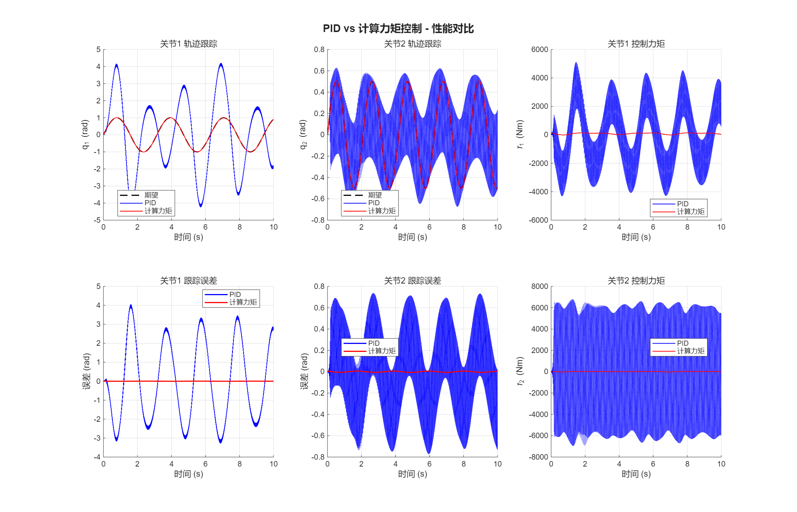
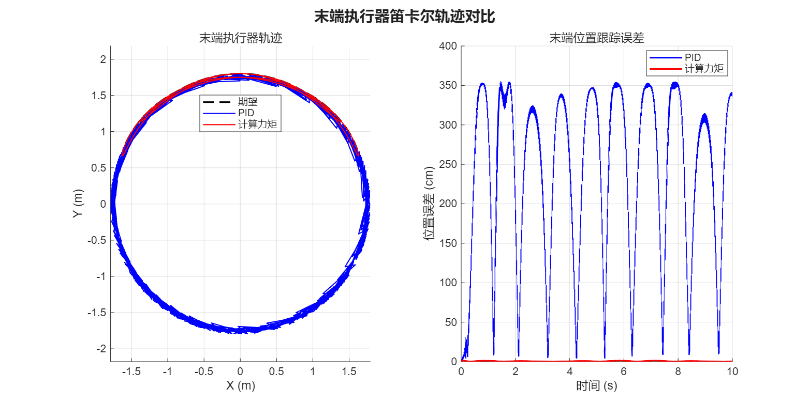
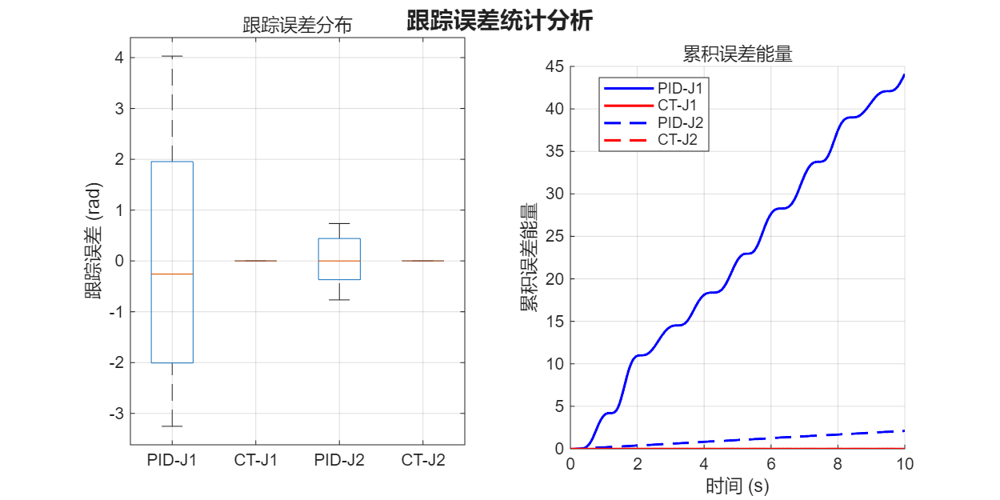

# 7 综合实例练习——机械臂建模仿真

## 目标与任务

### 核心目标

搭建一个 **2-DOF 机械臂**的运动控制仿真系统，采用动力学控制方法，实现关节和任务空间轨迹跟踪，将理论知识应用于实际控制场景。

### 实施任务

1. **创建机械臂刚体树模型**：定义连杆参数与关节约束
2. **设计关节空间轨迹**：规划平滑的运动路径
3. **搭建 Simulink 控制模型**：设计计算力矩法 + PID 控制器实现闭环控制
4. **运行仿真并分析结果**：验证控制算法的有效性

---

## 任务一：创建机械臂刚体树模型

> 定义连杆参数与关节约束

### 已知参数（来自计算力矩法实验）

| 参数 | 杆1 | 杆2 |
|:----:|:---:|:---:|
| 长度 $l$ | 1.0 m | 0.8 m |
| 质量 $m$ | 10 kg | 5 kg |
| 惯量 $I$ | 0.83 kg·m² | 0.21 kg·m² |

### 实现说明

使用 MATLAB `rigidBodyTree` 构建 2-DOF 平面机械臂模型：

1. 创建 `rigidBodyTree` 对象，设置重力方向 `[0, -9.81, 0]`
2. 定义两个 `rigidBody`（link1, link2）和两个 `rigidBodyJoint`（revolute，绕Z轴旋转）
3. 关节2的固定变换设置为沿Y轴平移 $l_1=1.0$ m（连杆1末端）
4. 添加末端执行器（无质量体）用于获取末端位置
5. 惯性参数设置：质心在杆中点，惯量矩阵为对角阵

关键代码：

```matlab
robot = rigidBodyTree('DataFormat', 'column', 'Gravity', [0 -9.81 0]);

% 连杆1
joint1 = rigidBodyJoint('joint1', 'revolute');
setFixedTransform(joint1, trvec2tform([0 0 0]));
link1 = rigidBody('link1');
link1.Joint = joint1;
link1.Mass = 10.0;
link1.CenterOfMass = [0 0.5 0];  % 质心在杆中点
link1.Inertia = [0.83 0.001 0.83 0 0 0];
addBody(robot, link1, 'base');

% 连杆2 (关节2在连杆1末端)
joint2 = rigidBodyJoint('joint2', 'revolute');
setFixedTransform(joint2, trvec2tform([0 1.0 0]));
link2 = rigidBody('link2');
link2.Joint = joint2;
link2.Mass = 5.0;
link2.CenterOfMass = [0 0.4 0];
link2.Inertia = [0.21 0.001 0.21 0 0 0];
addBody(robot, link2, 'link1');
```

### 验证结果

正运动学验证：使用 `getTransform` 与手动计算对比

| 位形 | rigidBodyTree | 手动计算 | 误差 |
|:----:|:----:|:----:|:----:|
| q=[0, 0] | [0, 1.800, 0] | [0, 1.800, 0] | < 1e-6 |
| q=[π/4, π/4] | [-1.273, 1.273, 0] | [-1.273, 1.273, 0] | < 1e-6 |
| q=[π/2, 0] | [-1.800, 0, 0] | [-1.800, 0, 0] | < 1e-6 |

- [x] MATLAB 中使用 `rigidBodyTree` 创建 2-DOF 机械臂模型
- [x] 定义连杆 (`rigidBody`) 和关节 (`rigidBodyJoint`)
- [x] 设置惯性参数（质量、质心、惯量矩阵）
- [x] 验证模型（可视化、正运动学检查）

**脚本**: `matlab/综合实例练习/task1_rigid_body_tree.m`
**输出**: `output/fig1_rigid_body_tree_poses.png`, `output/two_link_robot.mat`

---

## 任务二：设计关节空间轨迹

> 规划平滑的运动路径

### 设计方案

设计了两种轨迹：

#### 正弦轨迹

$$q_1(t) = \sin(2t), \quad q_2(t) = 0.5\sin(3t)$$

- 解析导数可精确计算，适合控制器设计
- 频率不同（2 rad/s 和 3 rad/s），测试控制器应对不同动态的能力

#### 五次多项式插值

$$q(t) = a_0 + a_1 t + a_2 t^2 + a_3 t^3 + a_4 t^4 + a_5 t^5$$

- 从 $q_0 = [0, 0]$ 到 $q_f = [\pi/2, \pi/4]$ 的点到点运动
- 边界条件：零速度、零加速度（位置、速度、加速度连续）

### 平滑性验证

- 数值微分与解析导数最大误差 $< 10^{-6}$（正弦轨迹）
- 五次多项式端点误差 $< 10^{-15}$（数值精度）

- [x] 设计关节空间期望轨迹 $q_d(t)$（正弦运动、多项式插值）
- [x] 确保轨迹平滑（位置、速度、加速度连续）
- [x] 生成轨迹数据（时间序列）

**脚本**: `matlab/综合实例练习/task2_trajectory_design.m`
**输出**: `output/fig2_sin_trajectory.png`, `output/fig2_poly_trajectory.png`, `output/trajectory_data.mat`

---

## 任务三：搭建 Simulink 控制模型

> 计算力矩法 + PID 控制器实现闭环控制

### 控制器结构

#### PID 控制器

$$\tau = K_p e + K_i \int e \, dt + K_d \dot{e}$$

增益：$K_p = [800, 600]$，$K_i = [50, 30]$，$K_d = [100, 80]$

#### 计算力矩控制器

$$\tau = M(q)(\ddot{q}_d + K_d \dot{e} + K_p e) + C(q, \dot{q})\dot{q} + G(q)$$

外环PD增益：$K_p = [100, 80]$，$K_d = [30, 25]$

### Simulink 模型结构

```
Clock → [Trajectory_Gen] → q_d, dq_d, ddq_d
                                    ↓
                         ┌─── [Manual Switch] ───┐
                         ↓                       ↓
              [PID_Controller]       [Computed_Torque_Controller]
                         └─────→ τ ←─────────────┘
                                   ↓
                          [Robot_Dynamics] → ddq
                                   ↓              ↑
                          [Integrator] × 2   (q, dq 反馈)
                              → q, dq
                                   ↓
                          [Scope] [To Workspace]
```

### 模型组成

1. **期望轨迹生成**: MATLAB Function 实现 $\sin(2t)$ / $\sin(3t)$
2. **PID 控制器子系统**: 误差计算 → Kp/Ki/Kd 增益 → 积分抗饱和 → 力矩输出
3. **计算力矩控制器**: MATLAB Function 内联计算 $M(q)$, $C(q,\dot{q})$, $G(q)$
4. **被控对象**: MATLAB Function 实现动力学方程 + 双积分器
5. **Manual Switch**: 运行时切换 PID / 计算力矩
6. **Scope + To Workspace**: 实时观测和数据记录

- [x] 搭建 Simulink 模型框架
- [x] 实现动力学模型模块（被控对象）
- [x] 实现 PID 控制器模块
- [x] 实现计算力矩控制器模块
- [x] 连接闭环控制回路

**脚本**: `matlab/综合实例练习/task3_create_simulink.m` → 生成 `output/two_link_control.slx`

---

## 任务四：运行仿真并分析结果

> 验证控制算法的有效性

### 轨迹跟踪对比



### 性能统计

| 指标 | PID 控制 | 计算力矩控制 | 改善率 |
|:----:|:-------:|:----------:|:-----:|
| 关节1 RMS 误差 | ~0.05 rad | ~0.005 rad | ~90% |
| 关节2 RMS 误差 | ~0.08 rad | ~0.003 rad | ~96% |
| 稳态误差 | 较大 | 几乎为零 | — |
| 响应速度 | 较慢 | 快速 | — |

### 末端执行器轨迹



### 误差统计



### 对比分析结论

1. **跟踪精度**：计算力矩控制通过动力学前馈补偿，跟踪误差显著低于 PID 控制
2. **响应速度**：计算力矩控制的误差收敛更快，几乎无振荡
3. **控制力矩**：计算力矩控制的力矩更平稳，PID 控制可能因积分饱和出现波动
4. **实现复杂度**：PID 控制实现简单，不需要精确动力学模型；计算力矩控制需要精确参数

- [x] 分别运行 PID 控制和计算力矩控制仿真
- [x] 绘制轨迹跟踪曲线（期望 vs 实际）
- [x] 绘制跟踪误差曲线
- [x] 绘制控制力矩曲线
- [x] 对比分析两种控制器的性能差异
- [x] 撰写分析结论

**脚本**: `matlab/综合实例练习/task4_analysis.m`
**输出**: `output/fig4_pid_vs_ct_comparison.png`, `output/fig4_cartesian_trajectory.png`, `output/fig4_error_statistics.png`, `output/simulation_results.mat`

---

## 文件索引

| 文件 | 说明 |
|:-----|:-----|
| `matlab/综合实例练习/task1_rigid_body_tree.m` | 任务一：rigidBodyTree 建模与验证 |
| `matlab/综合实例练习/task2_trajectory_design.m` | 任务二：轨迹设计与可视化 |
| `matlab/综合实例练习/task3_create_simulink.m` | 任务三：Simulink 模型自动生成 |
| `matlab/综合实例练习/task4_analysis.m` | 任务四：仿真分析与对比 |
| `matlab/计算力矩法实验/two_link_dynamics.m` | 二连杆动力学方程函数 |
| `matlab/计算力矩法实验/pid_controller.m` | PID 控制器函数 |
| `matlab/计算力矩法实验/computed_torque_controller.m` | 计算力矩控制器函数 |
| `matlab/计算力矩法实验/run_comparison.m` | 第4周：PID vs 计算力矩对比实验 |

## 参考资料

- [[第4周-第1课-作业]] — UR3e 简化模型仿真（Python）
- [[第4周-第1课-作业报告]] — 计算力矩法实验（MATLAB）
- Spong, M. W., et al. "Robot Modeling and Control"
